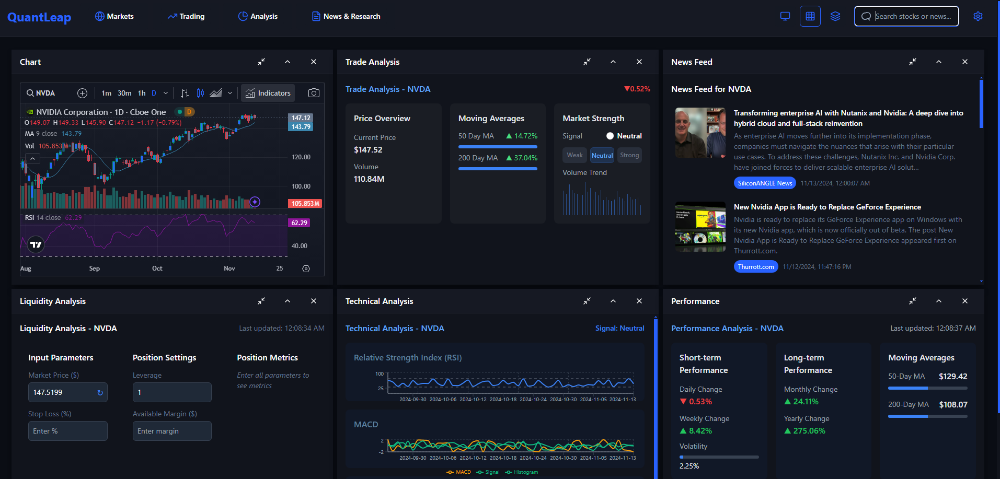
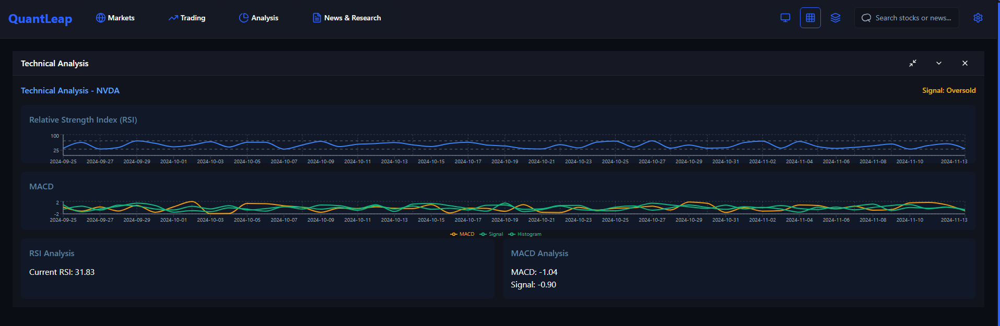
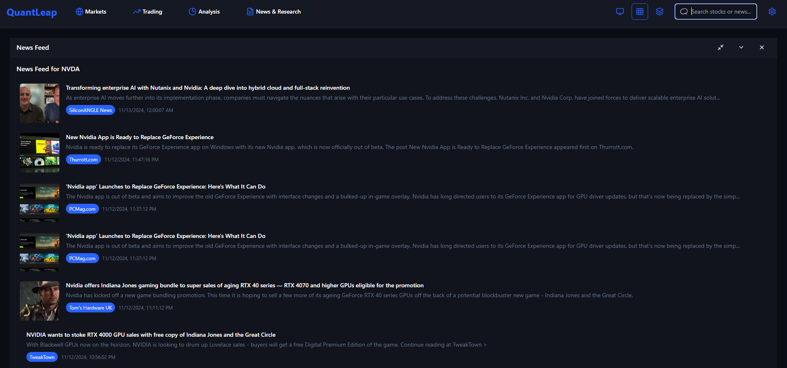
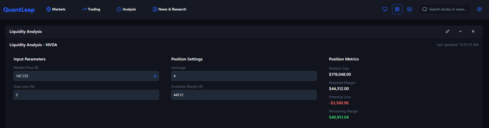

# QuantLeap Trading Terminal
 [QuantLeap](https://quantleap.vercel.app/)
## Table of Contents
- [Overview](#overview)
- [Features](#features)
- [Screenshots](#screenshots)
- [Technology Stack](#technology-stack)
- [Getting Started](#getting-started)
  - [Prerequisites](#prerequisites)
  - [Installation](#installation)
  - [Configuration](#configuration)
- [Running the Application](#running-the-application)
- [Project Structure](#project-structure)
- [Deployment](#deployment)
- [Contributing](#contributing)
- [License](#license)


## Overview

The **QuantLeap Trading Terminal** is an advanced trading dashboard designed to provide comprehensive tools for stock trend analysis, real-time market data, and portfolio management. Created with **Next.js** and **React**, this project offers a seamless, data-driven experience ideal for modern trading.

## Features

- **Real-Time Market Data**: Displays live stock prices, order books, and trade info.
- **Technical Analysis Tools**: Provides charts for indicators like RSI and MACD.
- **News Feed**: Aggregates live news relevant to your stock watchlist.
- **Liquidity Management**: Calculates real-time liquidity and allows for stop-loss and leverage entries.
- **Customizable Layout**: Flexible grid and tabbed views for organizing market data.
- **Search & Window Controls**: Minimize/maximize windows for quick data access.

## Screenshots

Include relevant screenshots to showcase the functionality:

### Dashboard


- **Dashboard**: A snapshot of the main trading interface.
### Technical Analysis



- **Technical Analysis**: Detailed chart views with technical indicators.

### News Feed

- **News Feed**: Display of real-time news.

### Liquidity Management



- **Liquidity Management**: Insights on risk position and SL.

## Technology Stack

- **Frontend**: Next.js, React, TypeScript, Tailwind CSS
- **Charting Libraries**: Recharts, Chart.js, react-chartjs-2
- **State Management**: React Hooks, Context API
- **APIs**: Axios for data fetching
- **UI Components**: MUI, Radix UI
- **Icons**: Lucide React

## Getting Started

### Prerequisites

Ensure you have the following installed:
- **Node.js** (v18 or higher)
- **npm** (v10.9.0 or higher)
- **Git**

### Installation

1. **Clone the Repository**:

   ```bash
   git clone https://github.com/colorfuldata/quantleap.git
   ```

2. **Navigate to the Project Directory**:

   ```bash
   cd quantleap-trading-terminal
   ```

3. **Install Dependencies**:

   ```bash
   npm install
   ```

### Configuration

1. **Environment Variables**:
   Set up your `.env.local` file with API keys for data sources.

   ```env
   # Example API keys
   NEWS_API_KEY=your_news_api_key
   YAHOO_FINANCE_API_KEY=your_yahoo_finance_api_key
   ```

2. **API Keys**:
   - Sign up for keys from [NewsAPI](https://newsapi.org/), [Yahoo Finance API](https://rapidapi.com/), etc.

## Running the Application

Run the development server:

```bash
npm run dev
```

The application will be accessible at [http://localhost:3000](http://localhost:3000).

## Project Structure

```
quantleap-trading-terminal/
├── public/
├── src/
│   ├── components/
│   ├── pages/
│   ├── services/
│   └── styles/
├── .env.local
├── package.json
└── README.md
```

- **components/**: Reusable UI components
- **pages/**: Next.js routes
- **services/**: API calls
- **styles/**: Global and component-level styling

## Deployment

This project is ready for deployment on Vercel. Follow these steps:

1. Sign in to Vercel and create a new project.
2. Connect your GitHub repository and configure environment variables on Vercel.
3. Deploy with a single click.

## Contributing

Contributions are welcome! Please fork the repository and create a pull request.

## License

This project is licensed under the [MIT License](LICENSE).

---

